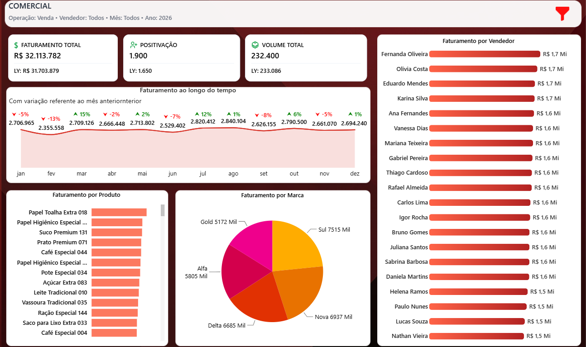
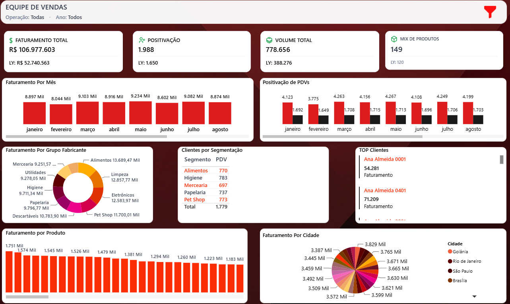
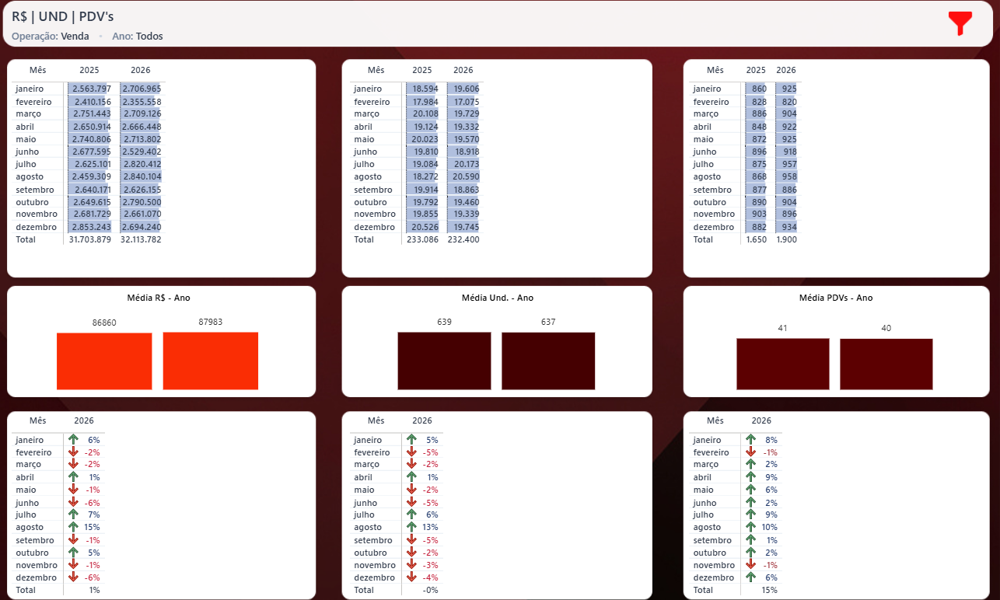
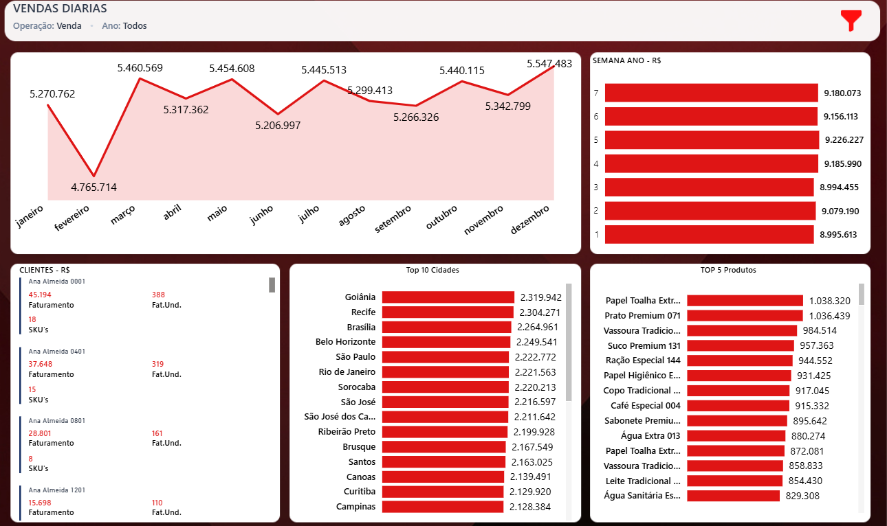

# 📊 Projeto de BI Comercial

## 📌 Sobre o projeto

Projeto de Business Intelligence desenvolvido em **Power BI**, com foco na análise de indicadores comerciais e acompanhamento do desempenho da equipe de vendas.

O dashboard foi desenvolvido utilizando **dados fictícios conectados ao Excel**, permitindo demonstrar a aplicação de conceitos de Business Intelligence sem utilizar informações reais ou confidenciais.

O layout e a identidade visual do projeto foram planejados e desenvolvidos no **Figma**, buscando criar uma interface intuitiva, organizada e visualmente consistente.

## 📈 Principais análises

O projeto apresenta diferentes visões para análise comercial:

- 💰 Faturamento total e evolução mensal
- 👥 Positivação de clientes e PDVs
- 📦 Volume de vendas
- 🛒 Mix de produtos
- 🏷️ Faturamento por marca
- 👨‍💼 Desempenho da equipe de vendas
- 👤 Análise de clientes
- 📍 Faturamento por cidade
- 📊 Comparação entre períodos
- 📅 Análise de vendas diárias
- 🏆 Ranking de produtos, clientes e cidades

## 📑 Dashboards

### Comercial

Visão geral dos principais indicadores comerciais, incluindo faturamento, positivação, volume, evolução mensal, produtos, marcas e desempenho dos vendedores.

### Equipe de Vendas

Análise do desempenho da equipe comercial, com indicadores de faturamento, positivação, volume, mix de produtos, clientes, cidades e fabricantes.

### R$ | UND | PDV's

Comparação dos indicadores comerciais entre períodos, permitindo analisar a evolução de faturamento, unidades vendidas e pontos de venda.

### Vendas Diárias

Acompanhamento das vendas ao longo do período, com análises de clientes, cidades, produtos e desempenho semanal.

## 🛠️ Tecnologias utilizadas

- **Power BI** — desenvolvimento dos dashboards
- **DAX** — criação de medidas e indicadores
- **Power Query** — tratamento e transformação dos dados
- **Excel** — fonte dos dados fictícios
- **Figma** — planejamento do layout e identidade visual

## 🎯 Objetivo

Demonstrar a aplicação prática de conceitos de **Business Intelligence**, desde a preparação dos dados até a criação de indicadores, modelagem e desenvolvimento de dashboards interativos.

## 🔐 Dados

> **Todos os dados utilizados neste projeto são fictícios e foram criados exclusivamente para fins de demonstração e portfólio.**

## 📊 Dashboards

### 🏢 Dashboard Comercial

### 👥 Equipe de Vendas

### 📈 Indicadores R$ | UND | PDV's

## 💻 Competências demonstradas

- 📊 Desenvolvimento de dashboards no Power BI
- 🧮 Criação de medidas e cálculos com DAX
- 🔄 Tratamento e transformação de dados com Power Query
- 🗂️ Modelagem e relacionamento de dados
- 📈 Criação e acompanhamento de KPIs
- 💰 Análise de indicadores comerciais
- 👥 Análise de clientes, vendedores e desempenho da equipe
- 📦 Análise de produtos, marcas e volume de vendas
- 📅 Análise temporal e comparação entre períodos
- 🎨 Planejamento de layout e identidade visual no Figma
- 📊 Visualização e apresentação de dados
- 📗 Utilização do Excel como fonte de dados

### 📅 Vendas Diárias

